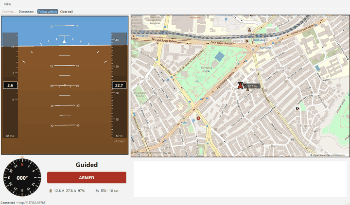
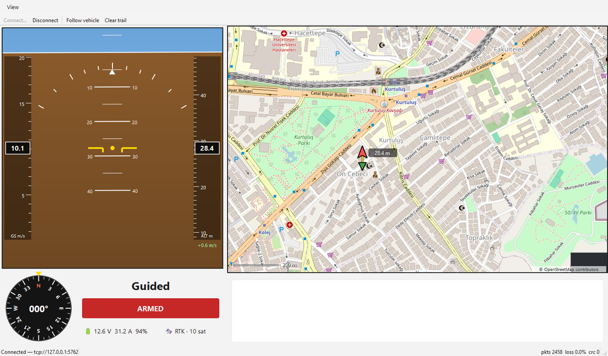

# Kerkenez GCS

[](https://github.com/conny0506/kerkenez-gcs/actions/workflows/ci.yml)

A UAV ground control station written in **C++20 / Qt 6**, speaking **MAVLink v2** and tested against **ArduPilot SITL** — no hardware required.



*Live capture: scripted guided flight in ArduPilot SITL — flight instruments on the left, live tracking on the map to the right.*

> 🇹🇷 *Türkçe özet aşağıda.*

## Why

Most hobby GCS projects wrap a web view around someone else's stack. Kerkenez is built from the transport layer up:

- **Raw MAVLink v2** framing over TCP/UDP/serial — own codec on top of the official `c_library_v2` headers, with CRC and sequence-loss tracking
- **Custom flight instruments** — artificial horizon, tapes and compass drawn with QPainter (no web view)
- **Offline-capable slippy map** — own tile engine with disk cache, built for environments where you cannot assume connectivity
- **Simulation-first workflow** — every feature is validated against ArduPilot SITL (Copter + Plane)

## Status — Phase 3 (map) ✅

| Phase | Scope | Status |
|---|---|---|
| 0 | Toolchain, SITL pipeline, MAVLink codec + tests, CI | ✅ done |
| 1 | Link layer (TCP/UDP/serial), vehicle model, reconnect | ✅ done |
| 2 | Telemetry panel / PFD (artificial horizon, tapes, alerts) | ✅ done |
| 3 | Map with offline tile cache, live tracking | ✅ done |
| 4 | Commands (ARM/Takeoff/RTL), waypoint mission editor, params | ⬜ |
| 5 | tlog recording + replay, flight summary | ⬜ |
| 6 | Release packaging, demo video | ⬜ |

Working today:
- **Moving map**: own slippy-map engine — OSM tiles, drag to pan, wheel to zoom around the cursor, vehicle icon rotated to heading, flight trail, home marker and a scale bar. Follow mode keeps the vehicle centred and releases as soon as you pan
- **Primary flight display**: artificial horizon with pitch ladder and roll scale, speed/altitude tapes and climb readout — all drawn with QPainter, no assets, no web view
- **Compass** with rotating rose and digital heading, **status panel** (mode, ARMED, battery, GPS) and an **alert panel** (TELEMETRY LOST / BATTERY LOW / NO GPS FIX banners + severity-colored autopilot log)
- **Auto-reconnect**: kill the link (or the vehicle) and the ground station reconnects on its own and re-requests telemetry streams — verified by restarting SITL mid-flight
- **Vehicle model**: locks onto the first autopilot heartbeat, maps ArduPilot Copter/Plane flight modes, watchdogs the heartbeat (3 s → LOST)
- Parser validated against a **recorded real SITL byte stream** checked into `tests/data/` (zero CRC errors, chunked feed equals whole feed); instruments have headless render tests
- **Scripted demo flight**: `tools\run_demo.ps1` boots SITL, flies a guided mission via pymavlink and watches it from the GCS (the GIF above is its `-GrabDir` output)

### Offline map

Tiles are cached to disk as they are viewed, so a previously seen area keeps
rendering with the network completely out of the picture — the case that matters
when a ground station leaves connectivity behind.



*Same flight, started with `--map-offline`: the fetcher issues no requests at all and the map is drawn from the cache. The dark square bottom-right is a tile that was never viewed online — missing data is shown as missing, not faked.*

## Build

Requirements: Qt 6.10 (MinGW), MinGW 13.1, CMake ≥ 3.21, Ninja. See [docs/setup.md](docs/setup.md) for one-command installs via `aqtinstall`.

```powershell
cmake --preset mingw-debug
cmake --build --preset mingw-debug
ctest --preset mingw-debug
```

## Run against SITL

```powershell
# one-time: download ArduPilot SITL prebuilt binaries (~25 MB)
powershell -ExecutionPolicy Bypass -File tools\get_sitl.ps1

# terminal 1 — start the simulated quad (Ankara home position)
cd tools\sitl\copter
.\ArduCopter.exe --model + --home 39.925533,32.866287,850,0 --defaults copter.parm -I0

# terminal 2 — live telemetry
.\build\mingw-debug\src\app\poc_telemetry.exe
```

## Architecture

```
src/core  — QtCore only: MAVLink codec, vehicle state, protocols (testable headless)
src/comm  — transports: TCP / UDP / serial links
src/map   — tile math, two-level tile cache, OSM fetcher (no GUI)
src/ui    — QtWidgets: instruments, map widget, mission editor
src/app   — application wiring + PoC tools
```

Details in [docs/architecture.md](docs/architecture.md), MAVLink usage notes in [docs/mavlink-notes.md](docs/mavlink-notes.md).

---

## 🇹🇷 Türkçe Özet

Kerkenez, **C++20 / Qt 6** ile yazılmış, **MAVLink v2** konuşan ve **ArduPilot SITL** ile donanımsız test edilen bir İHA yer kontrol istasyonudur. Hazır web bileşeni gömmek yerine ulaşım katmanından itibaren kendi yazılmıştır: özel MAVLink codec'i (CRC + paket kaybı takibi), QPainter ile çizilen uçuş göstergeleri ve **internet olmadan da çalışan**, disk cache'li kendi harita motoru. Faz 0–3 tamamlandı (iskelet, bağlantı katmanı, uçuş göstergeleri, harita); yol haritası yukarıdaki tabloda.

## License

[MIT](LICENSE). Vendored MAVLink headers ([third_party/mavlink](third_party/mavlink)) are MIT-licensed by the MAVLink project.
